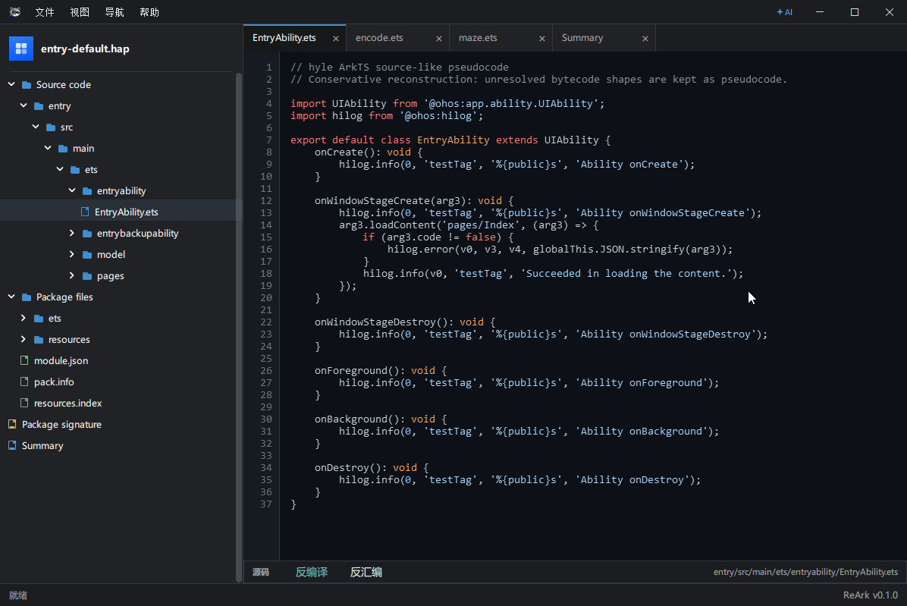
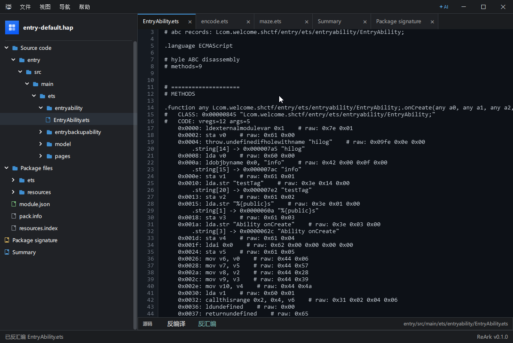
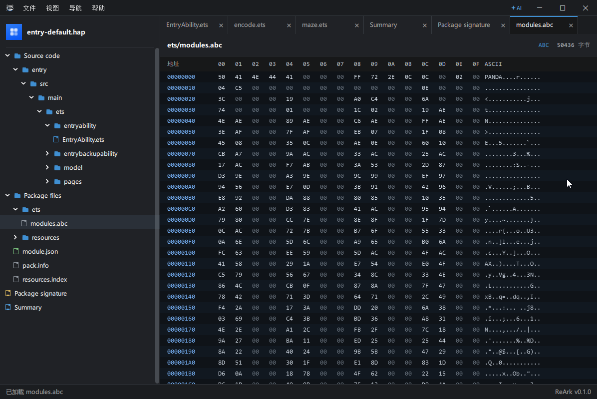
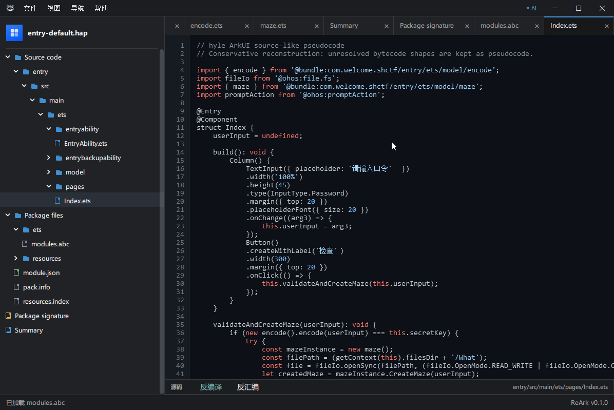
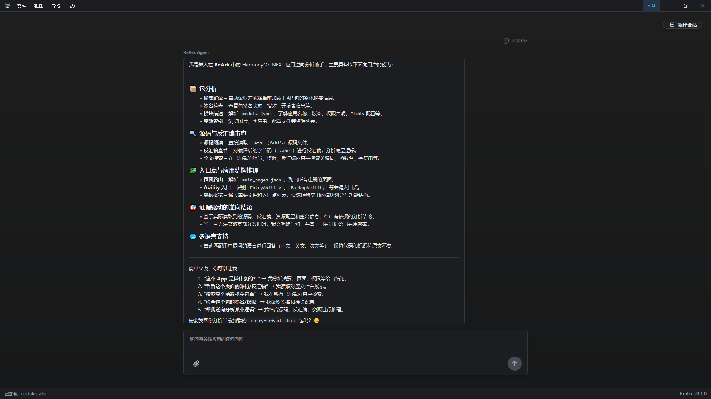
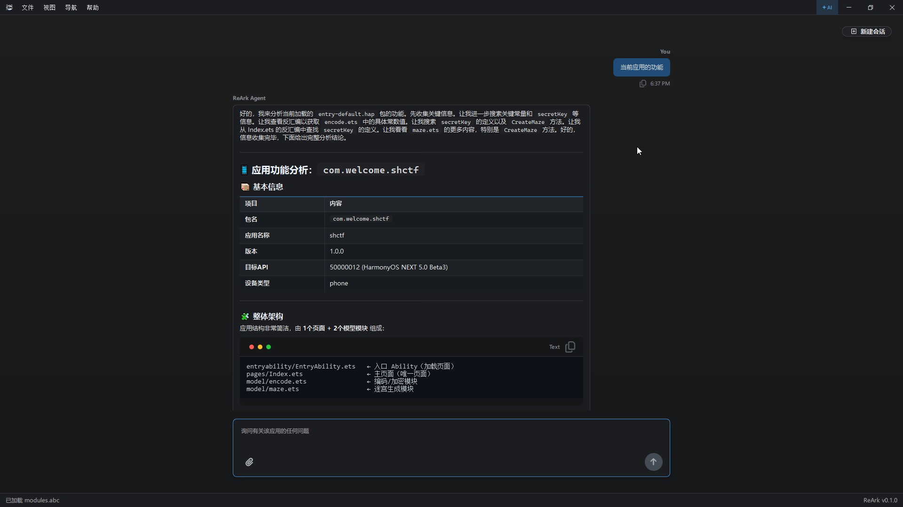

# ReArk

[English](README.md) | 简体中文

ReArk 是面向 HarmonyOS NEXT HAP/APP/ABC 文件的逆向分析工具，核心能力包括包结构浏览、Ark 字节码反汇编与反编译、资源预览、签名检查、搜索，以及可选的 AI 辅助分析。

## 概览

ReArk 面向合法授权的应用分析与安全研究场景。它提供桌面界面，用于打开 HarmonyOS 包、浏览反编译结果、检查资源文件，并围绕当前应用进行上下文问答。

当前版本：`0.1.0`

## 功能

- 打开 `.hap`、`.app` 和 `.abc` 文件。
- 浏览包结构、源码、资源和签名信息。
- 查看反编译源码、反汇编、格式化 JSON、图片、媒体、文本和十六进制内容。
- 在包文件树中搜索和快速打开文件。
- 检查包签名和证书信息。
- 使用 ReArk Agent 进行上下文应用分析，支持模型 Provider 预设、工具辅助包体检查和参考知识索引。
- 使用面向逆向分析工作流设计的桌面界面。

## 产品截图

| 工作区概览 | Ark 反汇编 |
| --- | --- |
|  |  |

| ABC / Hex 检查 | 页面反编译 |
| --- | --- |
|  |  |

| ReArk Agent | Agent 分析 |
| --- | --- |
|  |  |

## 快速开始

### 安装

下载并运行 Windows 安装器：

[ReArk-0.1.0-windows-x64-setup.exe](https://github.com/lkimuk/ReArk/releases/download/v0.1.0/ReArk-0.1.0-windows-x64-setup.exe)

## ReArk Agent

ReArk Agent 将模型辅助逆向分析直接接入工作区。它可以围绕当前打开的应用进行分析，按需检查包体元数据和文件内容，读取相关反编译源码或反汇编，并基于 ReArk 当前上下文生成结构化回答。

Agent 支持多种模型 Provider 和部署方式，包括 OpenRouter、OpenAI、OpenAI-compatible endpoint、Anthropic、Gemini、Ollama、DeepSeek、DashScope 和 Qwen。Provider 预设提供默认端点和推荐模型，也支持高级用户自定义 Base URL、模型名称、API Key 要求和 Embedding 设置。

ReArk Agent 还支持参考知识索引。你可以附加 Markdown、文本、HTML、JSON、CSV、PDF、DOCX、PPTX、XLSX 等文档，再让 Agent 结合包体上下文和外部参考资料进行分析。

Agent 面向最终用户输出：不会暴露内部工具名称或实现细节，会跟随用户语言回答，并保持 Markdown 与 ReArk 渲染环境兼容。

## 安全与隐私

ReArk 仅应用于合法授权的逆向工程、互操作研究、恶意样本分析和安全研究。请勿将其用于未授权绕过、攻击或数据提取。

使用 ReArk Agent 时，请避免向远程模型服务提供密钥、证书、用户数据、商业秘密或其他敏感内容。

## 许可

ReArk 使用 Apache License 2.0 许可。详情见 [LICENSE](LICENSE)。

第三方声明见 [THIRD_PARTY_NOTICES.md](THIRD_PARTY_NOTICES.md)。

## 支持

- 问题反馈：[GitHub Issues](https://github.com/lkimuk/ReArk/issues)
- 使用指南：[cppmore.com/ReArk](https://www.cppmore.com/category/ReArk/)
